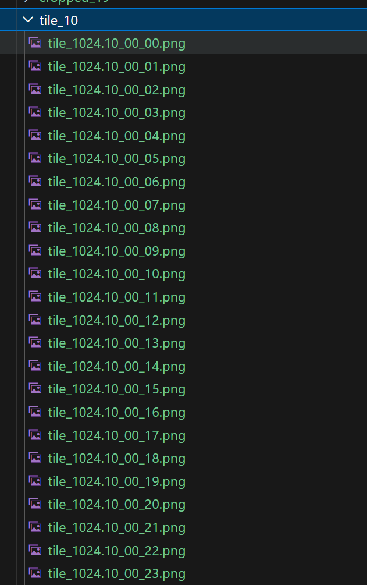

# Clip Image

> 裁剪图片的命令行工具

对输入的图片按指定的宽高进行批量裁剪，保存为png格式的图片。
最开始使用geotiff进行开发，理论上支持大部分格式图片，保存为8位png。


## Getting Started 使用指南


### Prerequisites 项目使用条件


```
rust 环境
```

### 测试数据

- tile_1024.10.tif 
- tile_1024.19.tif
- tile_1024.100.tif

### Usage example 使用示例

>  ./target/release/clip_image  ./data/tile_1024.10.tif  -O ./data/tile_10/ -W 32 -H 32 




## Release History 版本历史

* 0.0.1
    * CHANGE: project init


## Authors 关于作者

* **zhongq** - *Initial work* - [zhongq](https://github.com/zhongqing0507)


## License 授权协议

这个项目 MIT 协议， 请点击 [LICENSE.md](LICENSE.md) 了解更多细节。